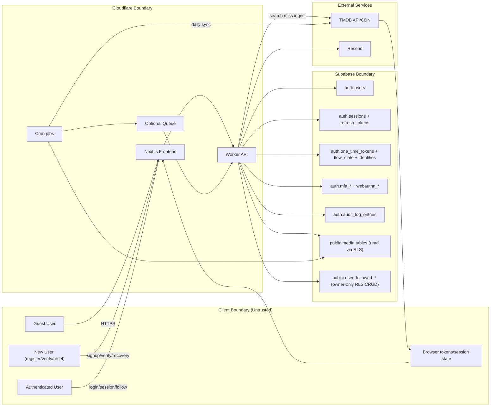

# Watchpapa Threat Model (Non-draw.io)

This threat model is derived from project docs and current architecture:
- `README.md`
- `Documentation/supabase_auth_model.md`
- `Documentation/supabase_public_model.md`

## Scope

- Frontend: Next.js on Cloudflare
- API: Cloudflare Workers
- Data: Supabase (`auth` + `public` schema)
- External systems: TMDB, Resend
- Key user states: guest, registering user, authenticated user

## Architecture (Mermaid)

## Assets to Protect

- Account identity and auth lifecycle (`auth.users`, session state)
- Follow ownership integrity (`user_followed_movies`, `user_followed_shows`)
- Media metadata integrity (movies/shows/people/credits)
- Secrets (`TMDB_API_KEY_SECRET`, database credentials)
- API and ingestion availability

## Threats by Area

### Authentication and Session

- Account takeover via credential stuffing/password reuse.
- Session theft or misuse of refresh tokens.
- Abuse of registration/recovery one-time token flows.
- Stale JWT claims causing authorization drift for sensitive operations.

### Authorization and Data Access

- RLS policy gaps exposing follow data across users.
- Incorrect reliance on user-editable metadata for authorization decisions.
- Over-privileged server credentials bypassing intended policy boundaries.

### API and Input Handling

- Injection or unsafe query building in Worker-side data access.
- Search-ingest endpoint abuse to trigger expensive TMDB calls.
- Missing rate limits allowing brute force and spam interactions.

### Ingestion and Third-Party Dependencies

- TMDB quota exhaustion causing degraded app behavior.
- Data poisoning or malformed external payload propagation.
- Cron/queue burst conditions causing internal denial-of-service.

### Observability and Non-Repudiation

- Missing end-to-end audit trail for follow changes and ingestion writes.
- Insufficient correlation between auth events and API actions.

## Existing Controls (From Current Docs)

- Public media read policies for `anon` and `authenticated`.
- Owner-only RLS policies on `user_followed_*` tables.
- Server-side TMDB API usage (no browser key exposure expected).
- Daily sync model with bounded concurrency and retry/backoff guidance.

## Recommended Security Backlog (Prioritized)

1. Validate all RLS policies with explicit tests for cross-user access denial.
2. Enforce strict input validation and endpoint-level rate limiting on Worker APIs.
3. Add abuse controls for auth flows (signup/login/reset throttling and lockout heuristics).
4. Ensure sensitive auth decisions do not rely on user-editable metadata.
5. Add structured audit logs linking auth session/user ID to follow and ingest mutations.
6. Restrict service-role usage to trusted server paths only; rotate secrets regularly.
7. Add incident runbooks for TMDB outage/rate-limit scenarios and auth anomaly response.

## Assumptions

- Supabase Auth and RLS are enabled and actively enforced in production.
- Worker APIs are the only write path to business-critical public tables.
- Secrets remain server-only and are never leaked to frontend runtime variables.
